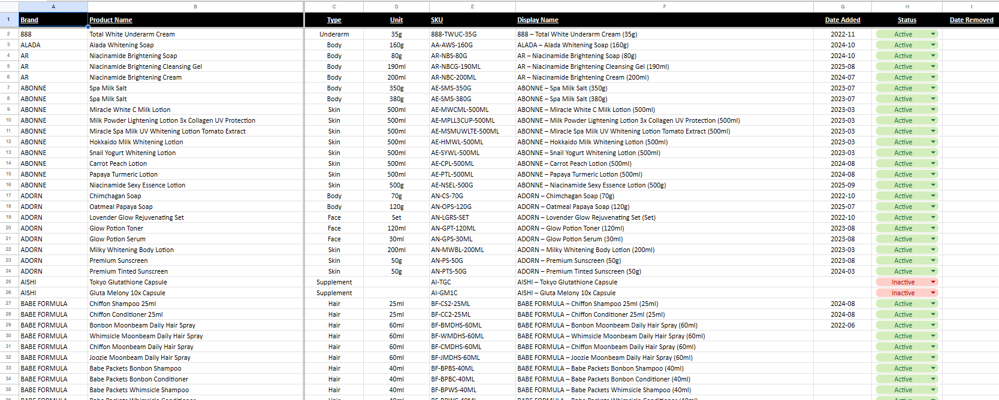

# 🧴 Top Brands Report — The Beauty Hub

A **Streamlit**-based interactive report that visualizes the **Top brands by product count** from *The Beauty Hub’s* product catalog, powered directly by data from **Google Sheets**.  
This dashboard highlights which brands dominate the catalog, grouping smaller contributors into an “Others” category for clarity and insight.

---

## 🚀 Features

- **🔗 Live Google Sheets Integration** — Automatically pulls the latest product data using the `gspread` API.  
- **📊 Dynamic Pie Chart Visualization** — Interactive Plotly donut chart showing top brands vs. others.  
- **🏆 Top Brand Highlights** — Displays logo cards for the top three brands with optional branding images.  
- **📈 Cumulative Analysis** — Breaks down product contribution percentages per brand and identifies top 60% performers.  
- **📁 Modular Structure** — Designed for easy maintenance and customization (logo handling, threshold tuning, etc.).

---

## 🧩 Tech Stack

| Technology | Purpose |
|-------------|----------|
| Streamlit | Web app framework for the dashboard |
| Pandas | Data cleaning and aggregation |
| Plotly | Interactive visualization (donut chart) |
| GSpread | Connects to Google Sheets API |
| Base64 | Encodes local images for web display |

---

Here’s a snapshot of the **Top Brands (by Product Count) Report Dashboard** built with Streamlit:


---

## 📊 The Simple Google Sheet Behind It

It all starts from a straightforward **9-column Google Sheet** — that only contains brands, product names, unit, and etc. 

Here’s a look at the source data that powers the entire dashboard:



> ✨ *This shows how powerful Streamlit + Google Sheets can be — turning everyday data into an interactive visual report!*


---

## ⚙️ Setup Instructions

### 1️⃣ Clone the Repository
```bash
git clone https://github.com/yourusername/beautyhub-topbrands-report.git
cd catalog_brands
```

### 2️⃣ Install Dependencies
```bash
pip install -r requirements.txt
```

### 3️⃣ Configure Google Sheets Access
```bash
Create or download your Google Cloud Service Account JSON key and place it in the following path:
/python/auth_keys/service_account.json
```

### 4️⃣ Run the App
```bash
streamlit run app.py
```