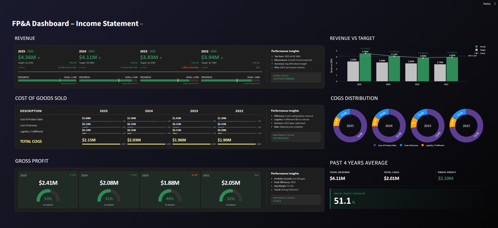

# FP&A Income Statement Dashboard

A high-density, interactive financial cockpit built with Streamlit, Plotly, and Pandas. This dashboard provides a multi-year analysis of Revenue, COGS, and Gross Profit performance against targets, featuring a custom Midnight themed UI.

## Dashboard Preview



## Features

* **Executive Revenue Overview**: Dynamic performance cards showing achievement vs. targets, year-over-year (YoY) momentum, and automated status flagging.
* **Target vs. Actual Tracking**: Visual bar charts and scatter trends with automated Delta calculations to highlight performance gaps.
* **COGS Breakdown**: Granular analysis of Product Sales, Services, and Logistics costs with integrated progress bars and percentage-of-total distributions.
* **Gross Profit Gauges**: Custom SVG semi-circle gauges for tracking Gross Profit Margin (GPM) health across multiple fiscal years.
* **Historical Averages**: A summary section calculating 4-year rolling averages for key financial KPIs including Revenue, COGS, and Gross Profit.
* **Midnight UI Design**: Custom CSS injection for a professional dark-mode gradient aesthetic using Calibri typography and glassmorphism-inspired containers.

## Tech Stack

* **Language**: Python 3.x
* **UI Framework**: Streamlit
* **Visualization**: Plotly
* **Data Processing**: Pandas, NumPy
* **Excel Engine**: OpenPyXL

## File Structure and Data Requirements

The dashboard reads from an Excel file named `income_statement_dashboard_data.xlsx`. Ensure the following sheets exist:

| Sheet Name | Description |
| :--- | :--- |
| **actuals** | Contains historical performance data for years 2022–2025. |
| **targets** | Contains the budgeted/forecasted goals for the same period. |

The code uses specific row indices for data extraction. Ensure your Excel rows for Revenue (Index 4), COGS (Index 9), and GP (Index 11) remain consistent with the script logic.

## Installation and Setup

1.  **Clone the repository:**
    ```bash
    git clone [https://github.com/yourusername/fpa-dashboard.git](https://github.com/yourusername/fpa-dashboard.git)
    cd fpa-dashboard
    ```

2.  **Install dependencies:**
    ```bash
    pip install streamlit pandas numpy plotly openpyxl
    ```

3.  **Run the application:**
    ```bash
    streamlit run app.py
    ```

## Dashboard Visual Logic

* **Revenue Status**: Automatically flags "OUTPERFORMING" if actuals exceed targets.
* **Profitability Status**: Logic-based status based on scaling efficiency relative to volume.
* **GPM Gauge Color Mapping**:
    * **Green**: Margin $\ge$ 40%
    * **Yellow**: Margin 30% - 40%
    * **Red**: Margin < 30%